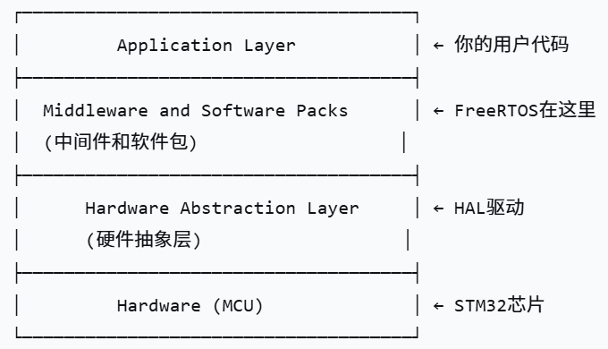
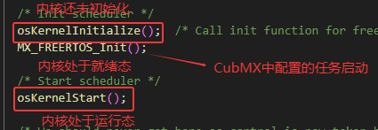
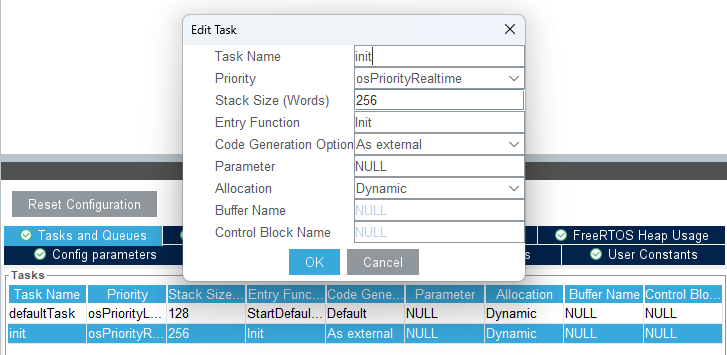
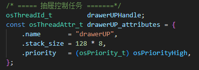
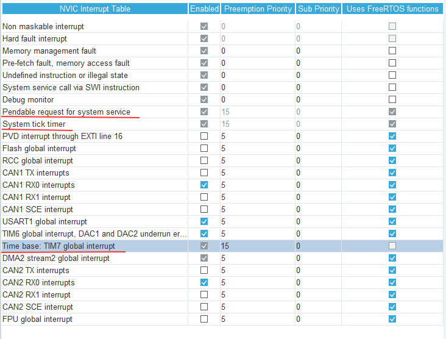
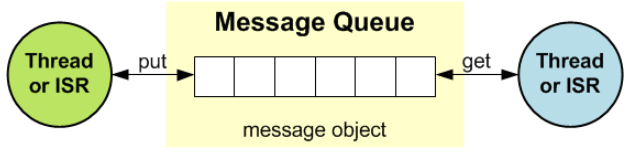
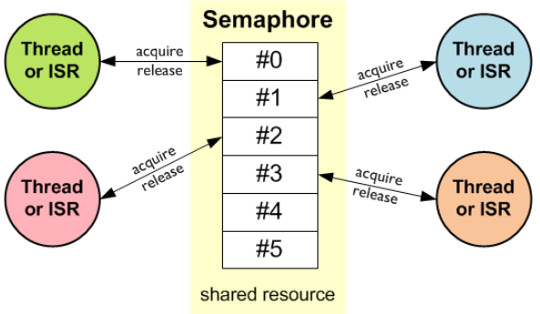
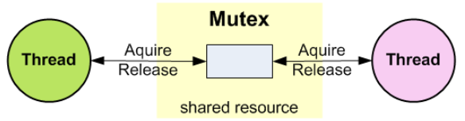
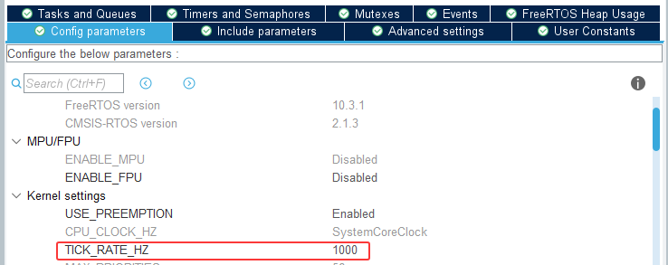

# 26赛季FreeRTOS培训课件V1.1

V1.1 author：rediduck ；CMSIS-RTOS Version：2.1.3

**感谢黄梓源学长对于此课件的贡献，本课件在CMSIS-RTOS2 函数介绍大量借鉴了黄梓源学长的学习笔记**

**本课件致力于帮助大家浅显的理解什么是 FreeRTOS，如何初步使用 FreeRTOS，深入层面还需大家自行探索**


## Chapter 1 线程

### 1、线程与进程的概念

-   **进程**：操作系统结构的基础，可以分配给处理器并由处理器执行的一个实体，包含程序的代码、运行状态以及资源（任务管理器）

-   **线程**：操作系统能够进行运算调度的最小单元，被包含在进程中，是进程的实际运作单位

-   **总结** ：一个操作系统可以同时执行多个进程

    ​	     一个进程可以执行多个线程

### 2、STM32 上的线程

#### 不使用 RTOS（裸机开发）

不存在线程的概念，只有主执行流


你的程序就会单一的在 main.c 文件中的 main 函数的 while 循环中单一执行

**好处**：简单易写，按顺序执行的代码可以抚平草履虫般的头脑

**坏处** ：容易写成屎山，不宜维护

   ​         无法实现复杂功能（可能需要你在 while 循环中搓一个类似于任务调度器的东西）

#### 	使用FREERTOS

**线程**被称为任务，是 FREERTOS 调度的基本单位，可以把每个任务理解为使用裸机开发时的一个 while 循环理论上来说，

只要栈空间足够，就可以创建很多个任务，不必再把不同机构的代码都放在同一个循环中

**好处**：可以实现复杂的逻辑，不用再把所有控制代码挤在一个函数中

​	    可以榨干 MCU 的潜能

**坏处**：需要考虑不同任务之间的优先级关系，需要考虑任务的空间使用以及使用同一资源任务的冲突

####  总结

-   对于校内赛那样控制功能简单，任务单一的车，用裸机开发十分方便迅速

-   对于正赛，一个STM32需要控制多个机构且多个机构可能同时执行自己的控制逻辑，主控板**严禁**使用裸机开发

## Chapter 2 FREERTOS

### 1、使用原因

**Free Real-Time Operating System**：顾名思义，免费实时操作系统

对于战队机器人的开发来说，我们非常在意代码运行的实时性

>   例如：遥控器通过串口传来消息，要去实时的解析，否则会变成高pin战士，操作手会发出尖锐的爆鸣
>
>   ​	   通过PID控制电机时，我们不希望PID运算时被其他任务打断或是PID计算的会被延迟，否则电机在开环运行下可能会跑飞
>
>   ​           我们希望通过状态机实时掌握各个机构、各个电机的状态，从而可以将机器的控制牢牢掌握在手里

- 不可能用一个 while 循环+中断来控制复杂的机构，必须要多个 while +硬中断+软中断相互合作来实现功能

- 对于各个初学者来说，FREERTOS 的学习相比于学习用通用操作系统加实时补丁，学习成本更低，便于直接上手

- STM32 稳定性好，CubMX 对 FREERTOS 的支持良好，我们不必繁琐地去手动移植

综上所述，**FREERTOS ** 能很好的满足多任务并发、生态支持良好、学习成本低、资金吃紧等等要求，所以选择 FREERTOS

### 2、基本概念



1、FREERTOS 构建了用户代码与硬件之间的中间层，通过调用 FREERTOS 的函数创建任务（任务可以简要的理解为一个 while 循环），FREERTOS 的内核调度器   可以让你的多个while循环看起来像是在同时执行，就像是在**用很多个单片机控制同一个机器**一样，这多个单片机共用数据、串口等等。

2、FREERTOS 只是让不同任务在宏观层面上（使用）看起来像是不同任务在同时进行，实际上因为只有一个MCU，它**只能一行一行地执行代码**，FRREERTOS通过内核调度器让不同任务在一个大的时间上（比如1s）瓜分时间片（1ms），从而让**宏观层面**上看来在这个大的时间内不同地任务都在执行。

3、并不是说给一个任务分一个时间片，那个任务执行完后MCU就傻等着什么都不干，FREERTOS的任务调度器切换MCU执行不同任务是多重机制的，是**定时检查+事件驱动**类型的。

>   例如：每个时间片会检查一次哪些任务就绪了，哪些任务需要切换了等等。
>
>   ​	   在特定函数执行时主动进行任务切换，如 xQueueSend()、xTaskNotifyGive()、taskYIELD()、vTaskDelay()（内部调用 taskYIELD()），因为一般一个	   任务执行一遍while中的代码在µs级别，而时间片的量级在1ms，所以如果不是在任务的while循环中再加while循环，一般一个任务用不满一个时间	   片。

4、任务一共有**运行、就绪、阻塞、挂起、删除**五种状态

-   就绪态：任务目前的状态可以被执行，只是MCU正在执行其他任务。

-   运行态：在一个时刻只可能有一个任务处于运行态，若有优先级更高的任务加入了就绪态，则目前运行的任务会立刻停止运行变为就绪态。相同优先级的任务会在调度器的分配下分配时间片依次运行。如果高优先级的任务一直运行，那么处于就绪态的低优先级的任务就会一直得不到运行。
-   挂起态：代表任务被冻结了，不参与调度器的调度。除非人为唤醒。
-   阻塞态：表示任务正在等待某个事件或者时间条件，在条件满足之后任务会被加入就绪态。
-   删除态：任务已经终止，资源正在等待或已经被清理。


​	

## Chapter3 CMSIS-RTOS2（重点）

### 1、基础概念

**CMSIS-RTOS2** 是 ARM 为 Cortex-M 微控制器设计的**第二代实时操作系统接口标准**。它是 CMSIS（Cortex Microcontroller Software Interface Standard）生态系统的一部分，提供了一套标准化的 RTOS API，使应用程序能够在不同的 RTOS 实现之间无缝移植。


CubMX为我们准备好了使用 FREERTOS 的API，我们无需手动移植、甚至无需关注使用的是什么 RTOS，**唯一**需要做的就是详细了解CMSIS-RTOS2为我们准备好的各个函数，根据自己的需求合理使用相应函数就可以实现多线程的开发了。

总而言之就是使用了CMSIS-RTOS2准备好的函数，只要能在不同的MCU上移植成功，就可以使同一套代码在不同MCU上、不同的RTOS上成功的跑起来，大大降低了开发的负担。总而言之就是 CubMX 已经为我们准备好了所有的前置条件，现在要做的就是：**1、学习 CMSIS-RTOS2 API**  **2、会在CubMX上配置 FREERTOS**

### 2、CMSIS-RTOS2 API接口介绍

这部分并不会全部介绍，会挑一些重点进行介绍，详情还得自行前往[CMSIS-RTOS2官网](https://arm-software.github.io/CMSIS_5/RTOS2/html/index.html)学习

#### 内核信息与控制

##### 数据结构

-   `struct osVersion_t` 标识底层的 RTOS 内核和 API 版本号

-   ```c
    enum osKernelState_t
    {
    	osKernelInactive = 0,			//内核未初始化
    	osKernelReady = 1,				//内核已初始化，准备好运行
     	osKernelRunning = 2,			//内核正在运行
      	osKernelLocked = 3,				//内核锁定
      	osKernelSuspended = 4,			//内核挂起
      	osKernelError = -1,				//发生错误
      	osKernelReserved = 0x7FFFFFFFU	//保留，无意义
    }
    ```

​	绝大多数情况下（只要我们不去手动操作内核），内核就会保持在正在运行的状态

​	

​	CubMX在生成代码的时候就已经帮我们在main.c中调用了内核的初始化函数和内核的启动函数，编写代码时无需关注内核启动

##### 函数

-   `osStatus_t osKernelInitialize(void)`

    用于初始化内核。**==不能在中断中使用==**

    返回值：

    -   `osOK` 初始化成功
    -   `osError `发生错误
    -   `osError` 从中断中使用了该函数
    -   `osErrorNoMemory` 没有足够的内存用于此操作

-   `osKernelState_t osKernelGetState(void)`

    用于获取内核当前状态，**==要在内核初始化后才能调用！可以在中断中使用==**

    返回值：内核状态

-   `osStatus_t osKernelStart(void)`

    用于启动内核和开始线程调度，如果启动成功就不会有返回值！换句话说就是调用的个函数的文件中下文就不会被执行，控制权已经给到了调度器

    **==不能在中断中使用==**

    

​	**注意**：CubMX会帮我们生成一个默认启动任务，这个任务无法在CubMX上删除也无法用外部定义，目前采取的做法是自己建一个启动任务选择As external,

​	这样就可以愉快的在UserCode中写初始任务而不用去手动修改CubMX为我们写好的文件。



-   `int32_t osKernelLock(void)`

    用于锁定内核，停止所有任务**切换**，会一直执行当前执行的任务，硬中断和软中断依然会执行。**==不能在中断中使用==**

    返回值：

    -   或是调用该函数前内核的状态（1：锁定；0：未锁定）
    -   或是`osError`发生错误；`osErrorISR`从中断服务函数中调用

-   `int32_t osKernelUnlock(void)`

    用于解锁内核，**==不能在中断中使用==**

    返回值：

    -   或是调用该函数前内核的状态（1：锁定，0：未锁定）
    -   或是`osError`发生错误；`osErrorISR`从中断服务函数中调用

#### 线程管理

##### 数据结构

- `struct osThreadAttr_t`用于配置任务的属性

    ```c
    typedef struct {
          const char                   *name;   ///< 任务名称（常用）
          uint32_t                 attr_bits;   ///< 线程属性位掩码（不常用），默认以分离模式创建，线程在终止时会自动释放资源
          void                      *cb_mem;    ///< 指向线程控制块内存的指针（不常用），默认动态分配内存
          uint32_t                   cb_size;   ///< 提供TCB内存大小（字节）（不常用），默认为0表示未提供TCB内存
          void                   *stack_mem;    ///< 不指向线程内存的指针，默认从内存池动态分配栈
          uint32_t                stack_size;   ///< 线程栈的大小（常用），如果线程的内存设置过小会产生内存溢出的问题导致程序不能正常运行
          osPriority_t              priority;   ///< 线程的优先级（常用），高优先级的任务处于就绪态时可以打断低优先级的任务
          TZ_ModuleId_t            tz_module;   ///< 安全拓展模块标识符（不常用），默认不启用
          uint32_t                  reserved;   ///< 保留字段（不用管），默认为0
          } osThreadAttr_t;
    ```



这是正赛代码中的一段配置，用来创建抽屉机构的任务的属性，一般创建属性的时候只需要关注图中三个变量即可，其他不赋值即是默认值

-   `osThreadId_t`任务句柄类型，相当于每个线程的身份证

-   `enum osThreadState_t`任务的状态<a name = "任务状态"></a>

    ```c
    enum osThreadState_t
    {
     	osThreadInactive = 0,			//该线程已创建但未被主动使用，或已被终止,可能线程被挂起了
      	osThreadReady = 1,				//线程已准备好执行，但目前没有运行
      	osThreadRunning = 2,			//线程正在运行
      	osThreadBlocked = 3,			//该线程当前被阻止（延迟，等待事件或暂停）
        osThreadTerminated = 4,			//该线程被终止并释放其所有资源
     	osThreadError = -1,				//线程引发了错误情况，无法进行调度
     	osThreadReserved = 0x7FFFFFFF	//保留，无意义
    }

-   `enum osPriority`任务的优先等级，相当于软件层面的中断优先级

    ```c
    enum  	osPriority_t {
      osPriorityNone = 0,
      osPriorityIdle = 1,
      osPriorityLow = 8,
      osPriorityLow1 = 8+1,
      osPriorityLow2 = 8+2,
      osPriorityLow3 = 8+3,
      osPriorityLow4 = 8+4,
      osPriorityLow5 = 8+5,
      osPriorityLow6 = 8+6,
      osPriorityLow7 = 8+7,
      osPriorityBelowNormal = 16,
      osPriorityBelowNormal1 = 16+1,
      osPriorityBelowNormal2 = 16+2,
      osPriorityBelowNormal3 = 16+3,
      osPriorityBelowNormal4 = 16+4,
      osPriorityBelowNormal5 = 16+5,
      osPriorityBelowNormal6 = 16+6,
      osPriorityBelowNormal7 = 16+7,
      osPriorityNormal = 24,
      osPriorityNormal1 = 24+1,
      osPriorityNormal2 = 24+2,
      osPriorityNormal3 = 24+3,
      osPriorityNormal4 = 24+4,
      osPriorityNormal5 = 24+5,
      osPriorityNormal6 = 24+6,
      osPriorityNormal7 = 24+7,
      osPriorityAboveNormal = 32,
      osPriorityAboveNormal1 = 32+1,
      osPriorityAboveNormal2 = 32+2,
      osPriorityAboveNormal3 = 32+3,
      osPriorityAboveNormal4 = 32+4,
      osPriorityAboveNormal5 = 32+5,
      osPriorityAboveNormal6 = 32+6,
      osPriorityAboveNormal7 = 32+7,
      osPriorityHigh = 40,
      osPriorityHigh1 = 40+1,
      osPriorityHigh2 = 40+2,
      osPriorityHigh3 = 40+3,
      osPriorityHigh4 = 40+4,
      osPriorityHigh5 = 40+5,
      osPriorityHigh6 = 40+6,
      osPriorityHigh7 = 40+7,
      osPriorityRealtime = 48,
      osPriorityRealtime1 = 48+1,
      osPriorityRealtime2 = 48+2,
      osPriorityRealtime3 = 48+3,
      osPriorityRealtime4 = 48+4,
      osPriorityRealtime5 = 48+5,
      osPriorityRealtime6 = 48+6,
      osPriorityRealtime7 = 48+7,
      osPriorityISR = 56,
      osPriorityError = -1,
      osPriorityReserved = 0x7FFFFFFF
    }
    ```

    与硬件中断相反，软件层面的线程任务优先级数字**越大**，优先级**越高**
    
    不过要注意的一点是，CubMX中配置的NVIC中断的优先级和这里的任务优先级有本质区别。
    
    要认识到：
    
    -   每个任务的死循环相当于不用FreeRTOS时main函数的while循环，任务的优先级是给任务调度器看的，不影响中断行为。任务的优先级再高，当中断发生时，也会去执行中断回调函数。
    -   任务调度器切换不同任务靠的是**SysTick中断**和**PendSV中断**，也就是前文所说的多重任务切换（定时切换+事件切换）。
    
    
    
    可以看到**SysTick中断、PendSV中断**和负责HAL库时基维护的**TIM7定时器中断**的优先级是非常低的，而CAN，DMA等中断优先级都高于它们。

##### 函数

-   `void (*osThreadFunc_t)(void* argument)`任务函数原型（告诉我们任务函数应该怎么写）

-   `osThreadId_t osThreadNew(osThreadFunc_t func, void* argument, const osThreadAttr_t* attr)`

    用于创建任务。**==不能在中断中使用==**

    传入参数：

    -   `func`：任务函数的函数指针，一般情况下传入函数名就可以了，编译器会帮你自动转化为函数指针
    -   `argument`：传递给任务的参数，也就是写函数时参数的实例化
    -   `attr`：任务属性，传入NULL为默认

    返回值：

    -   任务的独特ID，可以用这个ID通过其他函数来获取这个任务的状态

        >   ```c
        >   osThreadId_t     drawerOUTHandle;  // 任务的句柄（ID）
        >   
        >   const osThreadAttr_t drawerOUT_attributes = {
        >   
        >     .name    = "drawerOUT",
        >   
        >     .stack_size = 128 * 8,
        >   
        >     .priority  = (osPriority_t) osPriorityHigh,
        >   
        >   }; // 任务属性
        >   
        >   void DrawerOUT_Control(void* argument)
        >   {
        >     for (;;)
        >     {
        >   
        >   	//具体的任务执行逻辑
        >   
        >     }
        >     osDelay(10);
        >   }//任务函数
        >   
        >   drawerOUTHandle = osThreadNew(DrawerOUT_Control, NULL, &drawerOUT_attributes);
        >   ```

-   `osThreadState_t osThreadGetState(osThreadId_t threa_id)`

    用于获取目标任务的状态，**==不能在中断中使用==**

    传入参数：

    -   `thraead_id`：任务ID

    返回值：

    -   任务状态，详情见[任务状态](#任务状态)
    
-   `osStatus_t osThreadYield(void)`

    在任务中调用，用于立刻切换到下一个相同优先级且处于就绪态的任务，如果没有相同优先级的任务处于就绪态，那么当前任务就会继续执行。

    **==不能在中断中使用==**

    可能返回值：

    -   `osOK`：成功切换
    -   `osError`：出现错误
    -   `osErrorISR`：函数错误地被在中断服务函数中调用

-   `osStatus_t osThreadSuspend(osThreadId_t thread_id)`

    用于挂起任务。**==不能在中断中使用==**

    传入参数：

    -   `thraead_id`：任务ID

    可能返回：

    -   `osOK` ：目标任务成功挂起
    -   `osErrorParameter`： 传入的目标任务的句柄不存在
    -   `osErrorResource` ：传入的目标任务为无效状态
    -   `osErrorISR`：函数被错误地从中断回调函数中调用

-   `osStatus_t osThreadResume(osThreadId_t thread_id)`

    用于解挂任务。==**不能在中断中使用**==

    传入参数：

    -   `thraead_id`：任务ID

    可能返回：

    - `osOK`： 目标任务成功解挂
    - `osErrorParameter`：传入的目标任务的句柄不存在
    -  `osErrorResource`：传入的目标状态为无效状态
    -  `osErrorISR`：函数被错误地从中断回调函数中调用


-   `void osThreadExit(void)`（好用捏）

    用于退出任务函数。==**不能在中断中使用**==
    
-   `osStatus_t osThreadTerminate(osThreadId_t thread_id)`

    用于删除目标线程。**==不能在中断中使用==**

    **注意**：如果任务用的是可连接模式（FreeRTOS原生并没有这个模式，CMSIS-RTOS2自己拓展实现了），调用这个函数后内存并没有被释放，可能会发生内存溢出问题

    **tips**：一般我们在创建任务时都是用的默认的分离模式，对于这种模式的任务来说，在函数本身用osThreadExit()和用osThreadTerminate(ID)是没什么区别的，注意如果任务没有写成死循环，不要用return或者直接不写来退出，对于CubMX移植的CMSIS-RTOS2会存在严重问题。

    传入参数：

    -   `thraead_id`：任务ID

    可能返回：
    
    -   `osOK`： 目标任务成功解挂
    -   `osErrorParameter`：传入的目标任务的句柄不存在
    -    `osErrorResource`：传入的目标状态为无效状态或者目前没有其他可以就绪的任务（因为调度器至少要有一个可执行的任务）
    -    `osErrorISR`：函数被错误地从中断回调函数中调用

#### 消息队列

##### 用处

在线程之间交换信息，类似于FIFO（一个线程向队列放入信息，另一个线程从中拿出信息）



##### 数据结构

- `struct osMessageQueueAttr_t`

  ```c
  typedef struct {
    const char                   *name;   ///< 消息队列名称
    uint32_t                 attr_bits;   ///< 属性位，当前必须设置为0
    void                      *cb_mem;    ///< 控制块内存指针，控制块：存储消息队列内部状态的数据结构
    uint32_t                   cb_size;   ///< 控制块内存大小（一般用默认的动态分配就可以了）
    void                      *mq_mem;    ///< 消息数据存储区指针
    uint32_t                   mq_size;   ///< 消息数据存储区大小
  } osMessageQueueAttr_t;
  ```

##### 函数

- `osMessageQueueId_t osMessageQueueNew(uint32_t msg_count, uint32_t msg_size, const osMessageQueueAttr_t* attr)`

  创建一个队列。**==不能在中断中使用==**

  传入参数：

  - `msg_count`：队列深度
  - `msg_size`：一个消息的大小（单位：字节）
  - `attr`：队列的属性，若传入NULL为默认

  返回值：

  - 队列句柄
  
- `osStatus_t osMessageQueuePut(osMessageQueueId_t mq_id, const void* msg_ptr, uint8_t msg_prio, uint32_t timeout)`

  用于队列中写入信息（注意是**写入**，是值传递）。==**如果timeout设置为0则可以在中断中使用**==

  传入参数：

  - `mq_id`：队列句柄
  - `msg_ptr`：写入的消息指针，注意要和队列每个消息大小相匹配
  - `msg_prio`：消息优先级（数字越大，优先级越大）
  - `timeout`：最大消息等待时间（当队列已满时，当前线程应该等待多久）
    - 0：函数立刻返回（消息丢弃）
    - osWaitForever：该函数将无限期地等待消息发送
    - 0~osWaitForever：等待的时间（单位：内核滴答数）

  返回参数：

  - `osOK`：消息已经放入队列
  - `osErrorTimeout`：给定时间内无法将消息放入队列
  - `osErrorResource`：当`timeout`为0时队列已满
  - `osErrorParameter`：队列句柄不存在 
  
- `osStatus_t osMessageQueueGet(osMessageQueueId_t mq_id, const void* msg_ptr, uint8_t* msg_prio, uint32_t timeout)`
  
  用于从队列中读取信息。**==如果timeout设置为0则可以在中断中使用==**
  
  传入参数：
  
  - `mq_id`：队列句柄
  - `mag_ptr`：读取信息后存入的内存指针
  - `msg_prio`：读取消息的优先级后存入的内存指针（一般用不到，传入NULL即可）
  - `timeout`：调用一次这个函数时的最大等待时间
    	- 0：函数立刻返回（不管读没读到数据）
    - osWaitForever：该函数将无限期地等待队列中传来消息
    - 0~osWaitForever：等待的时间（单位：内核滴答数）
  
  返回参数：
  
  - `osOK`：消息已经从队列中接收
  - `osErrorTimeout`：给定时间内队列中没有消息
  - `osErrorResource`：当`timeout`为0时调用该函数时队列没有消息
  - `osErrorParameter`：队列句柄不存在

#### 信号量

##### 用处

信号量用于管理和保护对资源的访问，例如使得不超过一定数量的线程或中断服务函数访问一组共享资源。



本质上是一个高级一点的计数器。

##### 数据结构

- `struct osSemaphoreAttr_t`

  ```c
  typedef struct {
    const char                   *name;   ///< 信号量的名称
    uint32_t                 attr_bits;   ///< 保留位（没用），置0
    void                      *cb_mem;    ///< 控制块内存指针
    uint32_t                   cb_size;   ///< 控制块内存大小（单位：字节）
  } osSemaphoreAttr_t;
  ```

##### 函数

- `osSemaphoreId_t osSemaphoreNew(uint32_t max_count, uint32_t initial_count, const osSemaphoreAttr_t* attr)`

  用于创建信号量。==**不能在中断中使用**==

  注意不可以在内核初始化前创建

  传入参数：

  - `max_count`：可用令牌最大数量
  - `initial_count`：可用令牌的初始数量
  - `attr`：信号量属性，传入NULL为默认

  返回值：

  - 成功：信号量句柄
  - 失败：NULL

- `osStatus_t osMutexAcquire(osMutexId_t mutex_id, uint32_t timeout)`

  用于获取互斥量。**==不能在中断中使用==**

  

- `osStatus_t osSemaphoreAcquire(osSemaphoreId_t semaphore_id, uint32_t timeout)`

  用于***获取***信号量，获取信号量后处理完任务记得要手动的**给出**信号量。==**如果timeout设置为0则可以在中断中使用**==

  传入参数：

  - `semaphore`：信号量句柄
  - `timeout`：阻塞超时时间（单位：内核滴答）
    - 0：调用该函数时不管信号量是否还有剩余，都会立刻返回
    - osWaitForever：调用该函数时在信号量可获取之前会阻塞在这个函数，会把调用这个函数的线程置为阻塞态
    - 0~osWaitForever：如果信号量可获取，则会立刻返回；否则会阻塞指定的时间再返回

  返回值：

  - `osOK`：成功获取信号量
  -  `osErrorTimeout` ：在给定的时间内未能获取信号量
  - `osErrorResource`：当timeout为0时，调用该函数时没有获取到信号量 
  - `osErrorParameter`：传入的句柄错误

- `osStatus_t osSemaphoreRelease(osSemaphoreId_t semaphore_id)`

  用于***给出***信号量。==**可以在中断中使用**==

  传入参数：

  - `semaphore_id`：信号量句柄

  返回值：

  - `osOK`：信号量成功给出
  -  `osErrorResource` ：令牌无法给出，因为信号量计数已经满了（说明可能其他地方拿了一次放了多次）
  - `osErrorParameter`：信号量句柄错误

#### 互斥量

##### 用处

可以看作是深度为1的信号量，可以用来限制一个资源在一段时间内只被一个线程使用



##### 数据结构

- `struct osMutexAttr_t`用于配置互斥量的属性

  ```c
  typedef struct {
    const char                   *name;   ///< 互斥量的名字
    uint32_t                 attr_bits;   ///< 互斥量属性
    void                      *cb_mem;    ///< 控制块内存地址
    uint32_t                   cb_size;   ///< 控制块大小（单位：字节）
  } osMutexAttr_t;
  ```

  `attr_bit`的选择

  - `osMutexRecursive`：递归互斥量，允许同一线程多次获取互斥量，但是获取与释放要匹配，如果获取N次就要相应释放N次。
  - `osMutexPrioInherit`：带优先级继承的互斥量，可以防止优先级反转，当高优先级线程等待同一锁时，会临时提高这个持有锁的低优先级线程，从而保证高优先级任务能及时执行。
  - `osMutexRobust`：健壮互斥量，普通互斥量当持有锁的线程意外终止（崩溃、被杀死）时，普通互斥量会永远保持锁定的状态，导致其他需要持有该锁访问资源的线程就会永久等待（死锁），持有健壮互斥量的线程异常终止时，互斥量会进入不一致状态，下一个尝试获取锁的线程会收到错误码，可以选择”恢复“或”清理“互斥量。
  - `0`或默认：不具有以上属性，普通互斥量。

  若想同时使用多个属性时，只需在属性间加|即可，如`osMutexRecursive|osMutexPrioInherit`

##### 函数

- `osMutixId_t osMutexNew(const osMutesAttr_t* attr)`

  用于**创建**互斥量。**==不能在中断中使用==**

  传入参数：互斥量属性

  返回值：

  - 成功创建互斥量：互斥量句柄
  - 创建失败：NULL

- `osStatus_t osMutexAcquire(osMutexId_t mutex_id, uint32_t timeout)`

  用于**获取**互斥量。**==不能在中断中使用==**

  传入参数：

  - `mutex_id`：互斥量句柄
  - `timeout`：等待时间
    - 0：该函数立刻返回
    - osWaitForever：一直等待直到互斥量变得可获取，期间该线程会处于阻塞态
    - 0~osWaitForever：阻塞一定的时间，期间若互斥量可获取则直接返回

  返回值：

  - `osOK`：成功获取了这个互斥量，获取成功后线程会由阻塞变为就绪态
  - `osErrorTimeout`：在给定时间没有获取到锁
  - `osErrorResource`：当timeout为0时，调用该函数时没有获取到锁
  - `osErrorParameter`：互斥锁句柄错误
  - `osErrorISR`：错误地从中断服务程序中调用了该函数

- `osStatus_t osMutexRelease(osMutexId_t mutex_id)`

  用于**给出**互斥量。**==不能在中断中使用==**

  传入参数：互斥锁句柄

  返回值：

  - `osOK`：成功释放
  - `osErrorResource` ：互斥锁没有成功的拿到过或者拿锁的线程不是当前释放锁的线程
  - `osErrorParameter`：互斥锁句柄错误
  - `osErrorISR`：错误地从中断服务程序中调用该函数

#### 延时

##### 函数

- `osStatus osDelay(uint32_t ticks)`（相对延时）**==不能在中断中使用==**

  运行时相当于在这个函数中延长指定的时间，此时内核并不是不运行了，在一个线程的osDelay期间，这个线程是处于阻塞态的，此时MCU会去运行别的就绪态的线程，等阻塞了指定的时间会把这个线程置为就绪态。

  传入参数：

  - `ticks`：要延时的时间（单位：系统滴答数）

    

  返回值：

  - `osOK`：成功执行延时
  - `osErrorParameter`：传入了无效参数（0）
  - `osErrorISR`：错误地从中断服务程序中调用该函数
  - `osError`：没有成功执行延时
  
- `osStatus_t osDelayUntil(uint32_t ticks)`（绝对延时）==**不能在中断中使用**==

  当函数阻塞时逻辑和`osDelay`一样

  传入参数：

  - ticks：唤醒的时刻，运行到这个函数时，如果还没到这个时刻就一直阻塞，如果到了或者小于这个时刻就停止阻塞（不要超过2^32^-1）

  返回值：
  
  - `osOK`：成功执行延时
  - `osErrorParameter`：传入了参数超过范围
  - `osErrorISR`：错误地从中断服务程序中调用该函数
  - `osError`：没有成功执行延时
  
  >```c
  >#include "cmsis_os2.h"
  > 
  >void Thread_1 (void *arg) {             // 实例线程
  >  uint32_t tick;					
  >  tick = osKernelGetTickCount();        // 获取当前时刻
  >  for (;;) {
  >    tick += 1000U;                      // 设定下一次唤醒时间
  >    osDelayUntil(tick);					// 执行延时
  >    // ...
  >  }
  >}
  >```

##### 函数区别

- `osDelay`与`osDelayUntil`区别

>```c
>void Task(void *arguement)
>{
>    while(1)
>    {
>		task	//任务函数，比如说计算赋值之类的
>        delay	//延时
>    }
>}
>```


- os家族与HAL_Dealy区别

  用`osDelay`或者`osDelayUntil`时在延时的过程中是不消耗资源的，且如果调用这个函数的线程优先级比较高，在阻塞期间可以把资源释放出来给低优先级任务运行。
  
  用`HAL_Delay`时并不会把掉哟的调用该函数的线程挂入阻塞态，如果有其他同优先级的线程，就会在任务调度器分给自己的那个时间片内一直运行HAL_Delay,用完分得的时间片。如果其他就绪态任务优先级都比自己低，那么该线程就会一直运行，从而让低优先级线程饿死。
  
  而且当多个线程都用HAL_Delay时，可能会对延时的准确性造成影响。所以如果用CMSIS-RTOS2尽量都使用`os`系列，十分滴好用。

